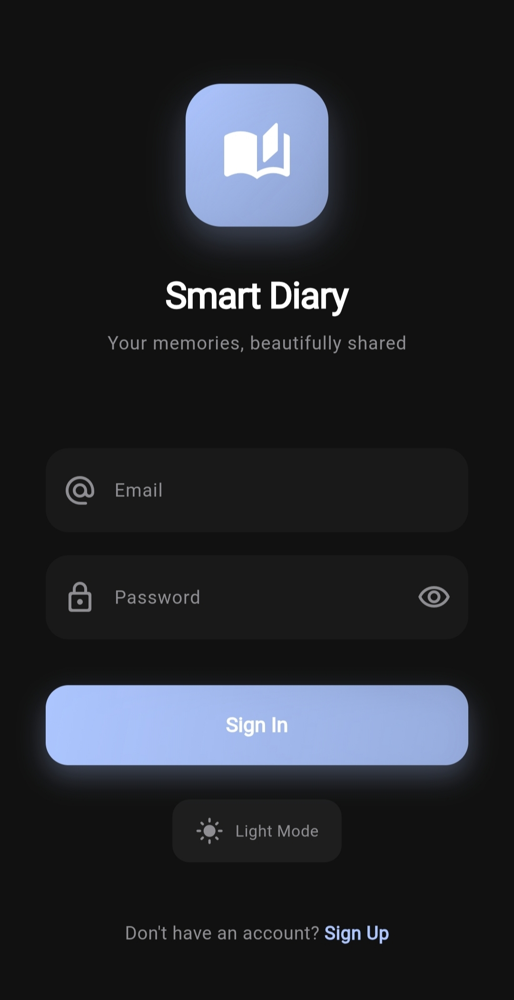
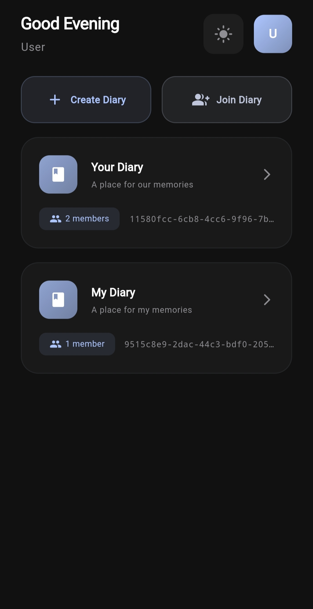
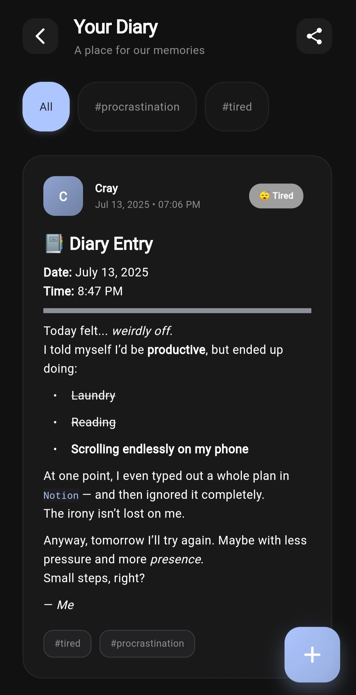
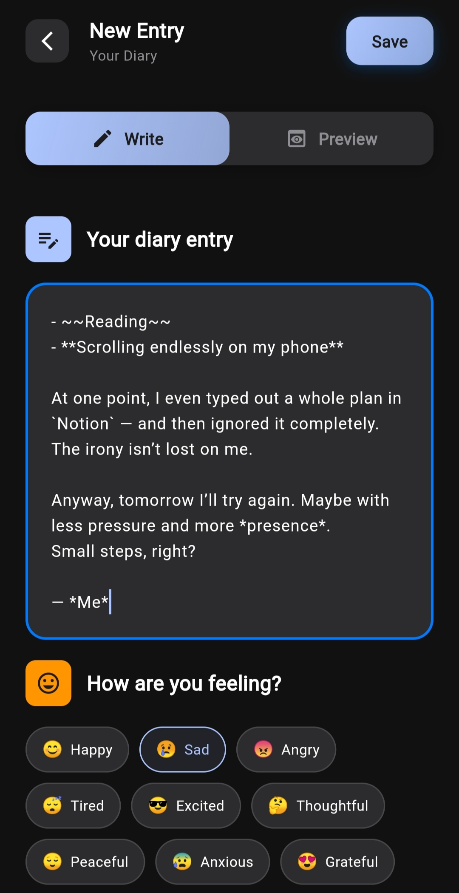
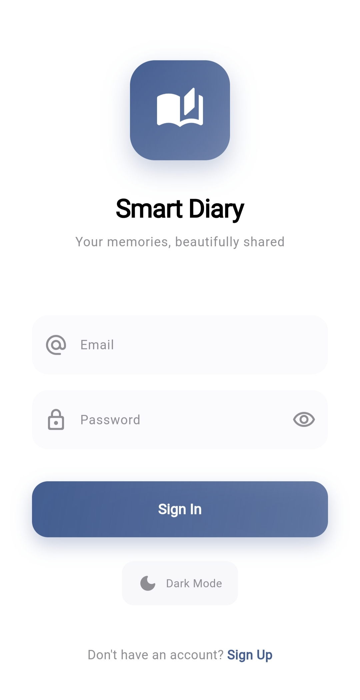
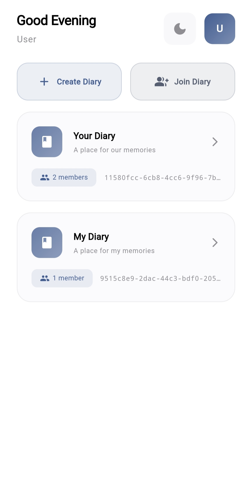
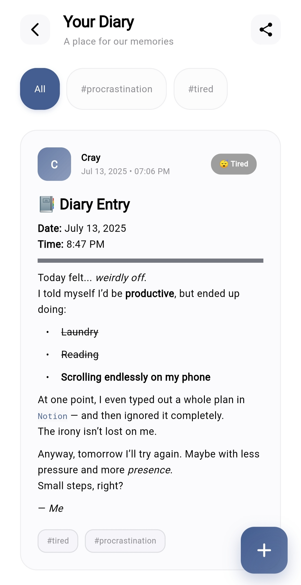
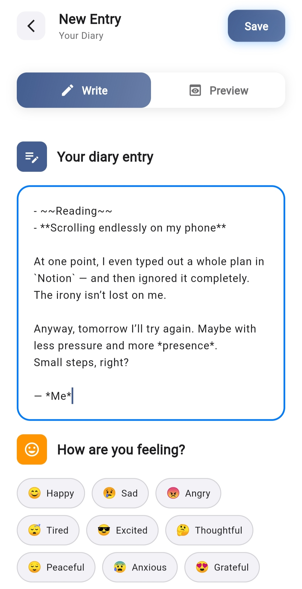

# 🌟 Smart Diary

A beautiful, modern diary application built with Flutter that allows users to create shared diaries, write entries with Markdown support, and collaborate with others in real-time.

## ✨ Features

### 🔐 Authentication

- **Firebase Authentication** with email/password
- Secure user registration and login
- Password reset functionality

### 📖 Shared Diaries

- **Create personal diaries** or collaborate with others
- **Join diaries** using unique diary codes
- **Real-time synchronization** across all devices
- **Member management** with proper permissions

### ✍️ Rich Entry Creation

- **Markdown support** for formatted text
- **Mood tracking** with intuitive emoji selection
- **Tag system** for easy organization and filtering
- **Real-time preview** of formatted content
- **Offline support** with automatic sync when online

### 🎨 Modern UI/UX

- **Apple-inspired design** with clean, minimal interface
- **Dark/Light theme support** with pitch-black dark mode
- **Smooth animations** and seamless transitions
- **Responsive design** that works on all screen sizes
- **Intuitive navigation** with floating action buttons

### 🔍 Advanced Features

- **Real-time filtering** by tags and moods
- **Search functionality** across all entries
- **Entry management** with edit and delete options
- **Diary management** with owner controls
- **Automatic timestamps** and user attribution

## 📱 Screenshots

### 🌙 Dark Mode

| Login Screen | Home Screen |
|:---:|:---:|
|  |  |

| Diary Entries | New Entry |
|:---:|:---:|
 |  |

### ☀️ Light Mode

| Login Screen | Home Screen |
|:---:|:---:|
|  |  |

| Diary Entries | New Entry |
|:---:|:---:|
|  |  |

## 🚀 Getting Started

### Prerequisites

- Flutter SDK (>=3.0.0)
- Dart SDK (>=3.0.0)
- Firebase project setup
- Android Studio / VS Code
- Git

### Installation

1. **Clone the repository**

   ```bash
   git clone https://github.com/CrayFish0/echo.git
   cd echo
   ```

2. **Install dependencies**

   ```bash
   flutter pub get
   ```

3. **Firebase Setup**
   - Create a new Firebase project at [Firebase Console](https://console.firebase.google.com/)
   - Enable Authentication (Email/Password)
   - Create Firestore Database
   - Download configuration files:
     - `google-services.json` → `android/app/`
     - `GoogleService-Info.plist` → `ios/Runner/`

4. **Configure Firestore Security Rules**

   ```javascript
   rules_version = '2';
   service cloud.firestore {
     match /databases/{database}/documents {
       match /users/{userId} {
         allow read, write: if request.auth != null && request.auth.uid == userId;
       }
       
       match /diaries/{diaryId} {
         allow read, write: if request.auth != null && 
           request.auth.uid in resource.data.members;
         
         match /entries/{entryId} {
           allow read, write: if request.auth != null && 
             request.auth.uid in get(/databases/$(database)/documents/diaries/$(diaryId)).data.members;
         }
       }
     }
   }
   ```

5. **Run the app**

   ```bash
   flutter run
   ```

## 🏗️ Project Structure

```
lib/
├── main.dart                 # App entry point
├── firebase_options.dart     # Firebase configuration
├── models/                   # Data models
│   ├── diary_model.dart
│   ├── diary_entry_model.dart
│   └── user_model.dart
├── providers/                # State management
│   ├── auth_provider.dart
│   ├── diary_provider.dart
│   └── theme_provider.dart
├── screens/                  # UI screens
│   ├── auth/
│   │   ├── login_screen.dart
│   │   └── register_screen.dart
│   ├── diary/
│   │   ├── diary_screen.dart
│   │   └── entry_editor_screen.dart
│   └── home_screen.dart
└── services/                 # Business logic
    ├── auth_service.dart
    └── firestore_service.dart
```

## 🛠️ Technologies Used

- **Flutter** - Cross-platform mobile framework
- **Firebase Auth** - Authentication service
- **Cloud Firestore** - NoSQL database
- **Provider** - State management
- **flutter_markdown** - Markdown rendering
- **shared_preferences** - Local storage
- **Material Design 3** - UI components

## 🎨 Design Philosophy

Smart Diary follows Apple's Human Interface Guidelines with:

- **Minimalist interface** focusing on content
- **Consistent typography** and spacing
- **Subtle animations** that enhance user experience
- **Accessible design** with proper contrast ratios
- **Responsive layout** adapting to different screen sizes

## 📋 Features Roadmap

- [ ] **Rich text editor** with formatting toolbar
- [ ] **Image attachments** in diary entries
- [ ] **Export functionality** (PDF, Markdown)
- [ ] **Push notifications** for shared diary updates
- [ ] **Advanced search** with filters
- [ ] **Backup and restore** functionality
- [ ] **Desktop app** support
- [ ] **Encryption** for sensitive entries

## 🤝 Contributing

We welcome contributions! Please follow these steps:

1. Fork the repository
2. Create a feature branch (`git checkout -b feature/amazing-feature`)
3. Commit your changes (`git commit -m 'Add amazing feature'`)
4. Push to the branch (`git push origin feature/amazing-feature`)
5. Open a Pull Request

### Development Guidelines

- Follow Flutter/Dart style guidelines
- Write meaningful commit messages
- Add tests for new features
- Update documentation as needed

## 📄 License

This project is licensed under the MIT License - see the [LICENSE](LICENSE) file for details.

## 🙏 Acknowledgments

- **Flutter Team** for the amazing framework
- **Firebase** for backend services
- **Material Design** for design inspiration

---

<div align="center">
  <b>Built with ❤️ using Flutter</b>
</div>
